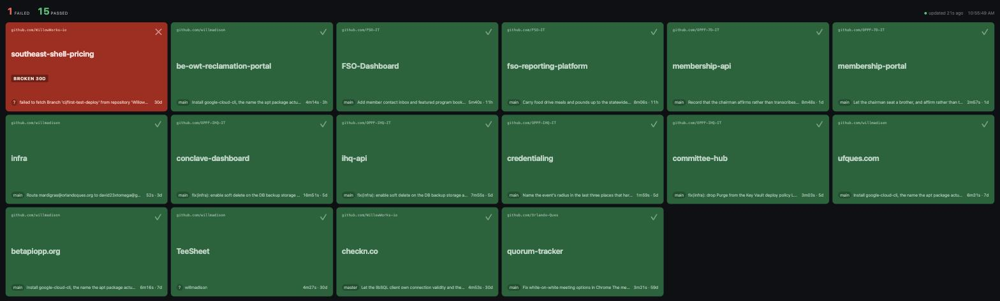

A CircleCI build radiator: one page, readable from across the room, that
replaces a browser tab per org.

Five CircleCI "All pipelines" tabs cost about 1.6 GB of Chrome. This
serves the same information from a single Go process holding around
22 MB, in one tab you can throw on a spare display and stop thinking
about.



## Design

It is a *radiator*, not a dashboard. Colour carries the signal and text
is secondary: failures sort to the top-left where the eye lands, a
running build spins and pulses so motion rather than reading tells you it
is live, and tile sizes scale with the viewport so the board fills
whatever display it lands on.

The CircleCI token is read from disk by the server and never reaches the
browser. The page talks only to `localhost`.

## Quick start

Needs **Go 1.27 or newer** (`go version` to check) and a CircleCI
account.

**1. Get a CircleCI API token.** Create a Personal API Token at
[app.circleci.com/settings/user/tokens](https://app.circleci.com/settings/user/tokens),
then put it somewhere the server can read:

    mkdir -p ~/.config/circleci
    printf '%s' 'YOUR_TOKEN_HERE' > ~/.config/circleci/token
    chmod 600 ~/.config/circleci/token

The token is read from disk by the server at startup. It never reaches
the browser and never goes in the repo.

**2. Write a config.**

    cp config.example.yaml config.yaml

`config.yaml` is gitignored. A minimal one is just:

```yaml
token_file: ~/.config/circleci/token
orgs:
  - gh/your-github-org
```

Your org slug is `gh/` plus your GitHub org or username -- the same name
that appears in a CircleCI pipeline URL,
`app.circleci.com/pipelines/github/<this-part>/…`. Use `bb/` for
Bitbucket. List as many orgs as you like; each is polled concurrently.

**3. Run it.**

    go run ./cmd/build-monitor -config config.yaml

Open <http://127.0.0.1:8770>. Or install it on your `PATH`:

    go install github.com/willowworks-io/build-monitor/cmd/build-monitor@latest

### Nothing on the board?

Errors are shown in a red strip along the bottom of the board rather
than hidden in the log, so most of these announce themselves.

| What you see | Usually means |
| --- | --- |
| `circleci returned HTTP 404` | The org slug is wrong, or your token cannot see that org. Check it against a CircleCI pipeline URL. |
| `circleci rejected the token` | The token is wrong, revoked, or the file holds something other than the token. |
| `read token: no such file` at startup | `token_file` points somewhere that does not exist. The server refuses to start rather than polling unauthenticated. |
| Empty board, no errors | The orgs are reachable but have no pipelines the filter admits. Try `branch_filter: "*"`. |
| A project you expected is missing | It has never run a pipeline. A radiator can only show builds that exist. |
| Fewer projects than you expected | `branch_filter: default` hides runs that were not on the repo's default branch. Set it to `"*"` to see everything. |

### Configuration

| Key | Meaning |
| --- | --- |
| `token_file` | Where to read the CircleCI personal API token. |
| `listen` | Address to serve on. Keep it on loopback. |
| `poll_interval` | How often to poll CircleCI. Floor of 15s. |
| `branch_filter` | `default` watches each repo's default branch; `*` watches every branch, like CircleCI's "All" tab. |
| `exclude` | Glob patterns matched against `org/project`, using the bare org name (`acme/widgets`), not the qualified one shown on tiles. |
| `orgs` | CircleCI org slugs, e.g. `gh/vibrant-wozniak`. `bb/` for Bitbucket. |

`branch_filter: default` is the classic build-monitor semantic — it
answers "is trunk green?" without feature-branch noise. Switch it to
`"*"` to mirror what the CircleCI web UI shows.

## On the board

Each tile carries more than a colour:

| | |
| --- | --- |
| Status glyph | A mark per state, so the board is readable in greyscale and to red-green colour blindness. Colour is never the only carrier. |
| Progress bar | Running builds show elapsed against that workflow's median duration, with an ETA. A spinner says something is happening; a bar says how much longer. |
| Broken for | Red tiles show how long they have been red and over how many builds. "Just broke" and "broken for a month" deserve different reactions. |
| Duration | How long the last run actually took, so a suite getting slower is visible. |
| Hatching | On-hold tiles are striped as well as recoloured, after Concourse -- texture reads as "deliberately not running". |

The tab icon tracks the board: the odd tile in the mark takes the worst
live state, and the title carries a failure count. The tab strip is the
smallest radiator there is, and a backgrounded tab is where a monitor
spends most of its time.

### Keyboard

| Key | |
| --- | --- |
| `f` | Fullscreen |
| `h` | Hide the header |
| `?` | Shortcuts |
| `esc` | Close |

## Status mapping

A project's tile shows the **worst** status across the workflows of its
latest pipeline, so one failed workflow colours the tile red even when
its siblings pass.

| CircleCI | Tile |
| --- | --- |
| `success` | passed |
| `failed`, `error`, `failing`, `unauthorized` | failed |
| `running` | running |
| `on_hold` | on hold |
| `canceled`, `not_run` | unknown (grey) |

Reported durations exclude time a run spent parked on an approval gate.
Wall clock counts a human deciding as though it were a build running, so
a pipeline approved the next morning reports as a seven-hour build. When
wall clock exceeds 20 minutes the duration is recomputed from job times,
skipping `approval`, `lock` and `unlock` jobs; below that threshold the
cheap number is used and no extra requests are made.

A pipeline whose `state` is `errored`, or that carries entries in
`errors`, is reported as **failed** with the reason on the tile. Such a
pipeline never produces workflows at all, so a rollup reading only
workflow status would paint it grey — which on a wall display reads as
"no news" when it actually means the build is broken.

## API shape notes

The v2 pipeline endpoint returns **no `vcs` block** for GitHub App
projects. Branch, SHA and commit metadata live under
`trigger_parameters.github_app` instead. Projects still on older webhook
triggers return an empty `trigger_parameters` entirely; they are kept on
the board rather than filtered out, with branch shown as `?`.

## Endpoints

| Path | Purpose |
| --- | --- |
| `/` | The radiator. |
| `/api/status` | Current board as JSON. |
| `/healthz` | Liveness. |

## Running it as a background service

On macOS, via launchd:

    cp deploy/io.willowworks.build-monitor.plist ~/Library/LaunchAgents/
    # edit the paths inside, then:
    launchctl load ~/Library/LaunchAgents/io.willowworks.build-monitor.plist

Logs land in `/tmp/build-monitor.{log,err}`.

On Linux the equivalent is a systemd user unit running the same binary
with the same `-config` flag; there is no unit file in the repo yet.

## Tests

    go test ./...

The rollup logic is the part worth trusting, so that is where the tests
are: status mapping, severity ordering, the errored-pipeline case, the
approval-hold duration correction, branch filtering and config
validation. They are pure functions and touch no network.

## License

MIT. See [LICENSE](LICENSE).
